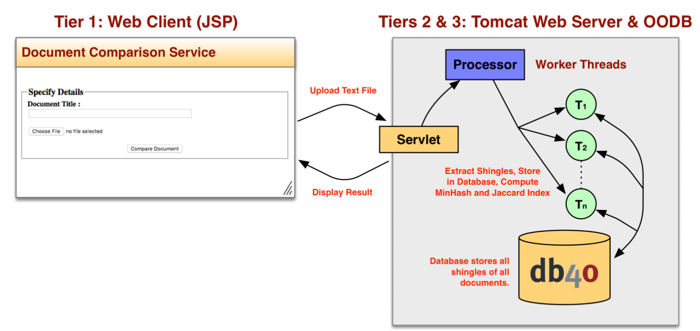
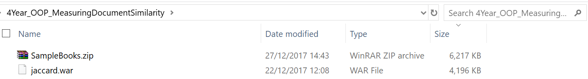
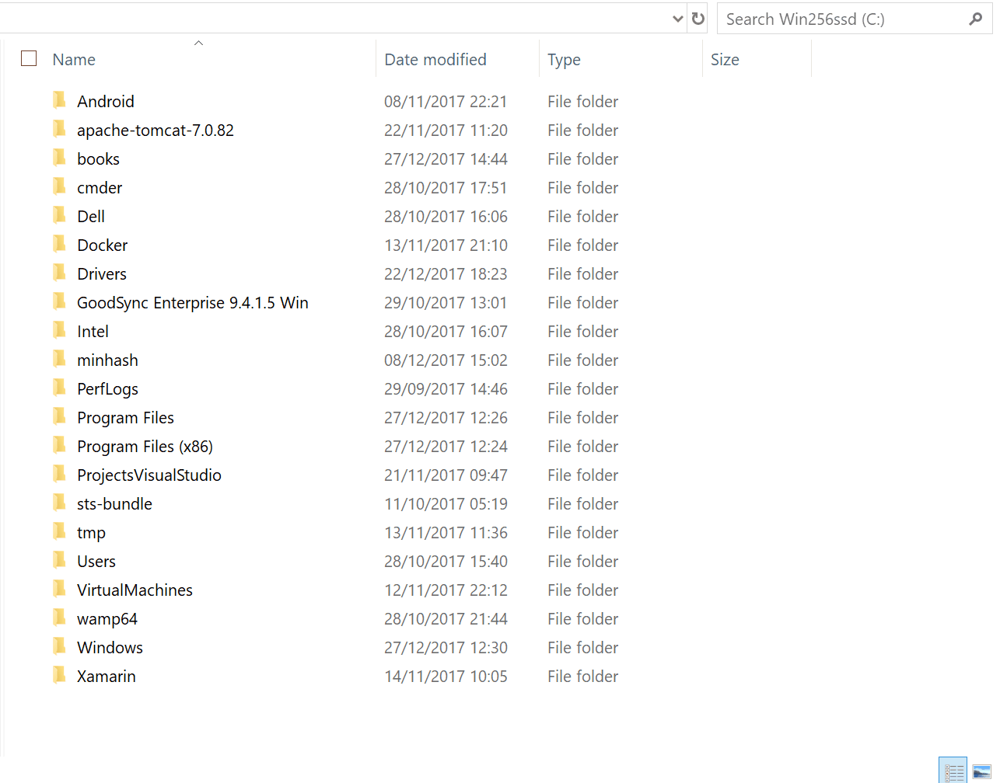
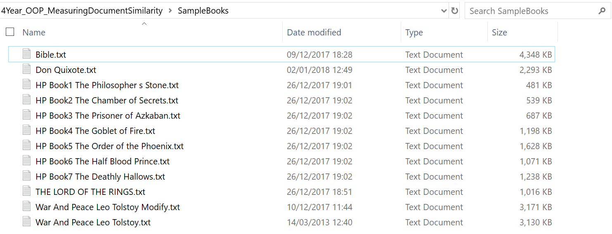
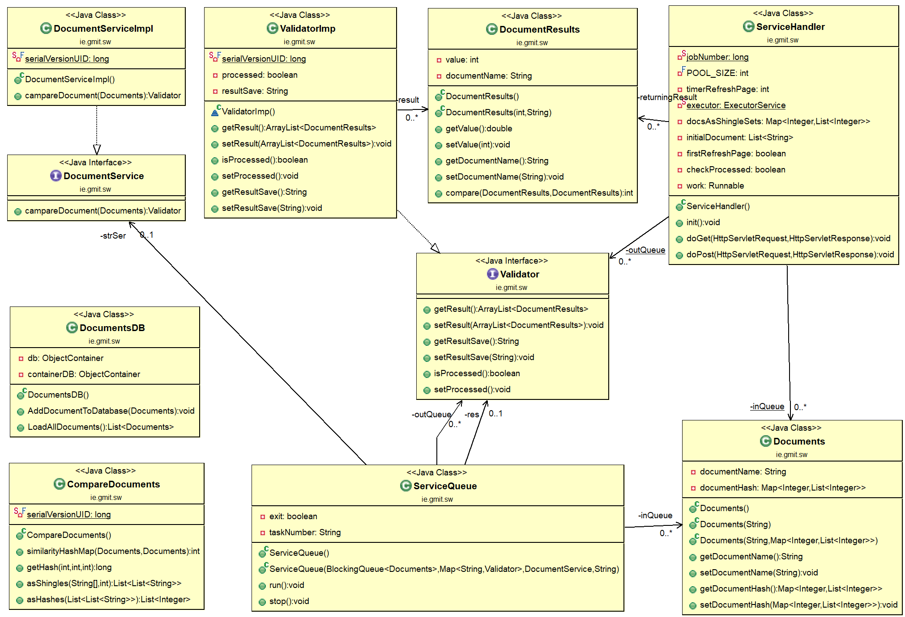

# 4Year Advanced Object-Oriented Design Principles & Patterns
## A JEE Application for Measuring Document Similarity

### Overview
You are required to develop a Java web application that enables two or more text documents to
be compared for similarity.



### Jaccard Similarity
A commonly employed technique for measuring the degree of similarity between two
documents is to represent the documents as sets of letters, words or sub sentences. If we
decompose a document into its set of constituent words, we can measure the similarity between
them using the Jaccard Index. Developed by the Swiss botanist Paul Jaccard in 1901, the
Jaccard Similarity of two sets.

### Db4o
db4o (database for objects) was an embeddable open source object database for Java and .NET developers. It was developed, commercially licensed and supported by Actian. In October 2014, Actian declined to continue to actively pursue and promote the commercial db4o product offering for new customers.
- Ref. https://en.wikipedia.org/wiki/Db4o


## Application deployed on Amazon

### http://54.210.4.37:8080/jaccard/


## INSTRUCTIONS FOR USE

### 1 - DOWNLOAD THE FOLLOWING FILES:
 - jaccard.war
 - SampleBooks.zip   (optional)



### 2 - TOMCAT 

After install the Tomcat, copy the file "jaccard.war" into the folder.

In this case I am using version 9, I tested in version 8 and it also works perfectly.
#### Windows
```
"C:\Program Files\Apache Software Foundation\Tomcat9\webapps" 
```

#### Mac
```
/usr/local/User/tomcat/9/libexec/webapps
```

#### Linux
```
/var/lib/tomcat9/webapps/
```

In the image below follows a demonstration of how to do deploy in windows and also how to start Tomcat.




### 3 - OPEN THE BROWSER
```
http://localhost:8080/jaccard/
```

## Examples of books
In the repository find some books that can be used as tests to find the percentage of similarities.

Please download the "SampleBooks.zip" file.

 

## UML Diagram



## HOW TO CREATE AN EXECUTABLE "WAR" FILE

### CEATING "WAR" FILE:

Into de folder "WebContent":
```
jar –cf jaccard.war *
```

# Author
### Alexander Souza
- G00317835@gmit.ie
- alexpt2000@gmail.com
- https://github.com/alexpt2000gmit
- https://github.com/alexpt2000
- www.linkedin.com/in/alexander-souza-3a841539/


